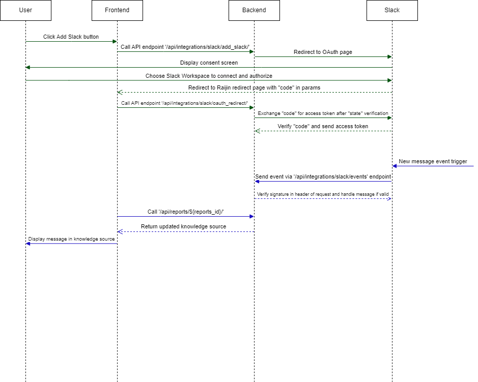

# cradar.ai

## Dependencies

For opening and saving non-wav files – like mp3 – you'll need ffmpeg or libav.

# To build and run

## In local

1. Install necessary packages, such as:
   - pipenv
   - mysql client
   - ffmpeg
2. Have the postgres database connection ready
3. Have the redis connection ready
4. Copy the content of .env.example to .env
5. Replace the following fields:
   - `OPENAI_API_KEY`
   - `GOOGLE_APPLICATION_CREDENTIALS`
   - `MASTER_DB_*`
   - `CELERY_BROKER_URL`
   - `EMAIL_HOST_USER` - Use gmail account
   - `EMAIL_HOST_PASSWORD` - **NOT** gmail account password. Please follow the [guideline](https://support.google.com/mail/answer/185833?hl=en) to create the app password and add it here.
6. Install the python dependencies - `pipenv install`
7. Go into the python virtual environment - `pipenv shell`
8. Migrate the database - `python manage.py migrate`
9. Start the server - `python manage.py runserver`
10. Start the celery beat for scheduled tasks - `celery -A cradarai beat`
11. Start the celery worker for scheduled and async tasks - `celery -A cradarai worker`

## Using local docker

```shell
docker compose --profile local up
```

This `local` profile will run frontend, nginx and db also.

# Adding new python packages

1. Determine if the new package is only for local or need to push to server
   1. For local only, run `pipenv install --dev <package-name>`
   2. To install in server, run `pipenv install <package-name>`
2. Check Pipfile to see if the installation is as per intended.
3. Fix the package version if possible to avoid version drift.
4. Generate the requirements.txt file `pipenv requirements > requirements.txt`

Note: In the server, python packages are installed from requirements.txt file rather than the pipenv because the versions are still drifting everytime we run `pipenv install`. So the step to generate the requirements.txt is really important for the server to install the new package.

# Celery

The cronjob is defined in cradarai/celery.py.

1. To run celery worker:

   ```shell
   celery -A cradarai worker
   ```

   Restart the celery worker if the celery task functions are updated.

2. To run celery beat (the process to queue the cronjob):

   ```shell
   celery -A cradarai beat
   ```

   Restart the celery beat if the schedules are updated.

3. To run flower to monitor the celery workers:
   ```shell
   celery -A cradarai flower
   ```
   After that, go to localhost:5555.

# Known issues

1. If you are using MacOS and encounter this issue when running celery
   ```
   objc[88793]: +[__NSCFConstantString initialize] may have been in progress in another thread when fork() was called.
   objc[88793]: +[__NSCFConstantString initialize] may have been in progress in another thread when fork() was called. We cannot safely call it or ignore it in the fork() child process. Crashing instead. Set a breakpoint on objc_initializeAfterForkError to debug.
   ```
   Please run this before set this env var `export OBJC_DISABLE_INITIALIZE_FORK_SAFETY=YES`


# Stripe Integration
Before testing Stripe after deploying this branch and running migrations, follow these steps:

1. Add a webhook endpoint and configure events in the Stripe dashboard:
   - Navigate to the Stripe dashboard.
   - Add a webhook endpoint URL and select the following events:
      - customer
      - checkout
      - price
      - product

2. Configure .env variables for Stripe in your system:
   - Ensure the following environment variables for Stripe are set in .env file:
      - `STRIPE_SECRET_KEY`
      - `STRIPE_PUBLISHABLE_KEY`
      - `STRIPE_WEBHOOK_SECRET_KEY`

3. Create a superuser for admin access:
   - Run `python manage.py createsuperuser` in the terminal.
   - Alternatively, update any user record in the database to set `is_staff=True` and `is_superuser=True`.

4. Access the Django admin interface:
   - Go to {backend_url}/admin and log in using the superuser credentials created in step 3.

5. Sync **Stripe products** and map usage types:
   - Go to [Stripe Products] and Click on top right [SYNC PRODUCTS WITH STRIPE]
   - After products are synced with Stripe, click on each product to map it with respective workspace usage types.

6. Sync Stripe prices:
   - Go to [Stripe Prices] in the admin panel.
   - Click on [Sync Prices With Stripe] at the top right corner to synchronize prices with Stripe.

7. Map features to products:
   - Navigate to [Feature Assignment] in the admin panel.
   - Create records to map features with each product for proper feature assignment.
 
8. Activate free trial subscriptions for workspaces:
   - Navigate to [Stripe Subscriptions] in the admin panel.
   - Click on [ACTIVATE FREE TRIAL SUBSCRIPTIONS FOR WORKSPACES] located at the top right corner of the page.

These steps ensure that your Stripe integration is properly configured and synced with your Django application, ready for testing.

# Slack Integration Documentation

## Using ngrok for local testing

1. Create the slack app.
   1. Go to https://api.slack.com/apps.
   2. Login and click on "Create New App".
   3. Select "From an app manifest".
   4. Select the corresponding workspace.
   5. Paste the manifest found in xxx.
2. Go to the Basic Information page in the slack app, copy the client id, client secret and signing secret to the .env file.
3. Start ngrok by running `ngrok http 8000`.
4. Add ngrok domain (starting with the uuid, without the "https://") to .env `ALLOWED_HOSTS`.
5. Go to the Event Subscriptions page in the slack app, update the request url to `https://{backend_domain}/api/integrations/slack/events/`, check that it is verified, and click Save Changes.
6. Go to the OAuth & Permissions in slack dashboard and set the Redirect URLs to the value below. Then set the same value to the `SLACK_REDIRECT_URI` in .env:
   1. For local testing set `SLACK_REDIRECT_URI=https://{backend_domain}/api/integrations/slack/to-frontend/`
   2. For prod set `SLACK_REDIRECT_URI=https://{frontend_domain}/slack/redirect`
7. Go to frontend page and click Add To Slack button on header. Will be navigated to Slack OAuth page.
8. Click continue and proceed with authorization after reading permissions. Will be redirected to the redirect URL provided.
   1. For local testing, this will redirect to `{backend_domain}/api/integrations/slack/to-frontend/` which will then redirect to `{frontend_domain}/slack/redirect`. We do this because ngrok only support one port.
   2. For production, this will redirect to `{frontend_domain}/slack/redirect` directly.
9. The frontend redirect page will call `{backend_domain}/api/integrations/slack/oauth-redirect/` after successful authorization. This will add `SlackUser`.

10. Back on Raijin, click Add Your Data.
11. Click Slack Channel Autocomplete field to open dropdown of Slack channels. Check that channels correspond to channels in connected Slack Workspace.
12. Select desired Slack channel. Knowledge Source will be created.
13. Go to Slack and send test messages.
14. Ensure that redis server is connected, ensure that celery worker and celery beat is running.
15. If testing end-of-day buffer, wait till end of day at 23:59 to check that Knowledge Source has been updated with test messages.
16. If testing functionality without waiting for buffer time, run:

```
python manage.py shell
from api.tasks import process_slack_messages
process_slack_messages()
```

Then check that Knowledge Source is updated with Slack test messages.

## Overview

This document provides details on integrating our application's backend with Slack, focusing on handling messages from Slack channels, mapping these to knowledge sources (notes), and updating these sources accordingly.

## Prerequisites

- A Slack App must have been created on Slack API website and configured with the necessary credentials and scopes: https://api.slack.com/apps
- Required Scopes: `channels:read`, `groups:read`, `mpim:read`, `im:read` for reading functionalities, and `channels:history`, `groups:history`, `im:history`, `mpim:history` for accessing message histories. `users:read` to retrieve user info in workspace.
- Required User Token Scopes: `channels.read` to retrieve list of channels.
- Event Subscriptions setup in the Slack App to receive Slack events.
- Required Bot events: `message.channels`, `message.groups`, `message.im`, `message.mpim` to allow Slack App to be triggered when messages are posted in the respective channels in the Workspace.

## Integration Process

### 1. Slack App Configuration

Configure your Slack App with the following settings:

- **OAuth & Permissions**: Set the Redirect URI to the frontend redirect page URL for example: 'https://YOUR_DOMAIN/slack/redirect'. Set the required scopes as mentioned in Prerequisites Required Scopes.
- **Event Subscriptions**: Enable and set the request URL to the backend endpoint that processes Slack events, for example: 'https://YOUR_DOMAIN/api/integrations/slack/events/'. Subscribe to bot events as mentioned in Prerequisites Required Bot Events.

### 2. OAuth & Permissions

Integration initiates with OAuth where users authorize the application, allowing it to access their Slack Workspace.
A state is generated and stored in database for verification later.
returns a URL to the frontend to redirect to Slack OAuth page.

**Endpoint to generate state and redirect user to Slack OAuth page:**
`/api/integrations/slack/add_to_slack/`
**View:**
`api/views/slack/add_slack.py`

Once authorized, user is redirected back to Raijin with a "code" and "state" parameters.
We will retrieve and validate the state received with the stored state to ensure request is indeed from Slack.
If validated, we exchange the "code" for an access token from Slack which we store for future API calls to Slack.

**Endpoint to handle redirect from Slack OAuth page and exchange code for access token:**
`/api/integrations/slack/oauth_redirect/`
**View:**
`api/views/slack/oauth_redirect.py`

### 3. Event Handling

Our backend listens for Slack events, particularly for messages to update the system accordingly.

**Endpoint:** `/api/integrations/slack/events/`

This endpoint secures Slack requests, handles `url_verification`, and processes `message` events through `event_callback`.

### 4. Processing Slack Messages

Upon a `message` event, the backend updates the corresponding note based on the notes that have the corresponding channel_id and team_id that matches that of the message.

### 5. Channel to Knowledge Source (Note) Mapping

`channel_id` and `team_id` is added to a Note's fields when a Note is created via the creation of a Slack Knowledge Source. `team_id` is the ID of the Slack Workspace as the sole use of `channel_id` is insufficient as an identifier since Slack channels in different Slack Workspaces can share the same `channel_id`.

## Sequence Diagram

Below is the sequence diagram illustrating the communication flow between the user, frontend, backend, and Slack:



# Code practices

1. Use model - serializer - view approach. So that we have consistent schema, and we can render the schema in swagger.
2. Implement create, update and delete logics in serializers, not views.
3. Handle request errors by raising `rest_framework.exceptions`. Do not return a 4xx response directly. This is for consistency, so that we have the same format for the json response.
4. When adding new environment variable, add it in .env.example, and read it into [settings.py](cradarai/settings.py). Do not read environment variables directly from other parts of the code, so that we keep track of all the environment variables that affect the apps.
5. Use [`InProjectOrWorkspace` permission](api/permissions.py?plain=1#L13) to authorize the access of the resource referred by the first id in the url. See the following example for more details:
   - In the following url `/api/projects/{project_id}/reports/`, the first (and only) id in the url is `project_id`.
   - Check if user has the permission to access the resource (project in this case).
   - If the user has the right access, attach the resource to the `request`.
   - In the serializers and views, access the resource from the `request` to reduce the number of queries.

# Google Drive Integration Documentation

## Steps for local testing

1. Setup for Google Console:
   - Go to Google Cloud web interface to access the API & Services page for Raijin: https://console.cloud.google.com/apis/credentials/oauthclient/
   - Go to the Credentials tab. You should see "Raijin Google Login" as the Name.
   - Set Authorized JavaScript Origins URL as frontend localhost domain, for e.g. `http://localhost:5173`
   - Set Authorized redirect URIs as `{frontend localhost domain}/googledrive/redirect`
   - Save changes
2. Runserver on backend and start frontend to login to Raijin web app.
3. Find "Connect to Google Drive" button on header component. Click to kickstart OAuth process.
4. "Connect to Google Drive" button will bring you to Google OAuth page. Choose Google account you want to connect Raijin account to and click "continue".
5. After successful authorization, the page will automatically redirect to frontend redirect page, which will show a success message popup.
6. Page will automatically redirect back to Raijin account after success message popup is displayed.
7. Open Create Knowledge Source Dialog on frontend page and click on the Google Drive input component.
8. Check that Google Drive files are accessed and displayed in the dropdown.
9. Select Google Drive file to create Knowledge Source with and click "continue".
10. Once Knowledge Source is created, check that the Knowledge Source has the correct file attached to it.
